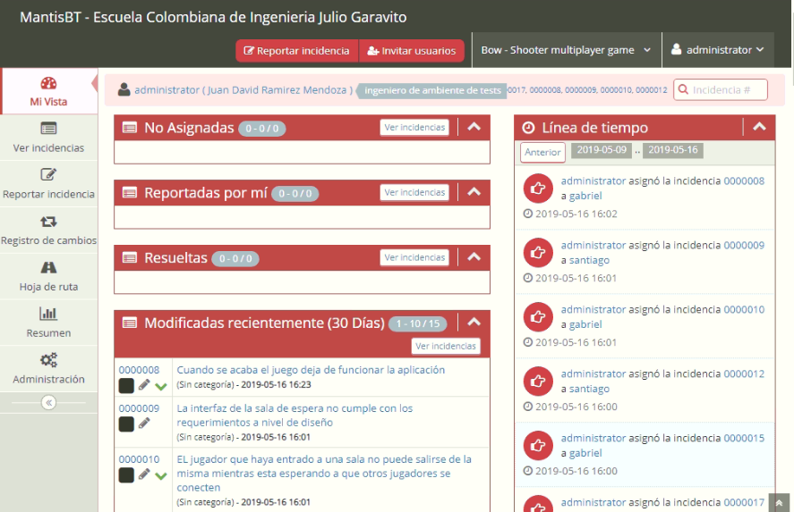
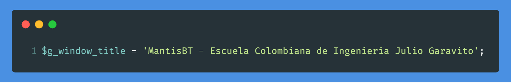

Escuela Colombiana de Ingeniería Julio Garavito Mantis Customization project
=============================

Vistas principales
-----------

Documentación
-------------

Para revisar la documentación de la personalización realizada junto con la definición de las políticas extraidas del modelo de tests utilizado revise el informe que se realizó al respecto.

Por otro lado, si necesita revisar la documentación detallada de cada una de las funcionalidades de Mantis Bug Tracker consulte el [manual](https://www.mantisbt.org/documentation.php) del mismo.

Requerimientos
------------

 * MySQL 5.5.35+, PostgreSQL 9.2+, o otra base de datos soportada
 * PHP 5.5.9+
 * un webserver (e.g. Apache or IIS)

Se recomienda instalar [Apache XAMPP](https://www.apachefriends.org/es/index.html) ya que viene integrado con un servidor web apache y una base de datos MySQL 

**Nota:** *Si quiere conocer el paso a paso detallado del proceso de instalación de Apache XAMPP revise el manual creado*

Instalación
------------

 * Descargue la última version estable de [MantisBT](https://www.mantisbt.org/download.php)
 * Copie la carpeta dentro del directorio htdocs de su servidor web.
 * Acceda en el browser a la carpeta mantis, a continuación se deberán correr los scripts php de instalación y configuración.
 * Una vez loggeado dentro de mantis con la cuenta de administrador (administrator - root) cambie la contraseña a su gusto en el panel de configuración de Mantis.
 * Elimine el directorio *admin* dentro de la carpeta de mantis.
 
**Nota:** *Para mas información sobre la instalación consulte el manual creado*

Configuración
-------------

# Diseño
- **Imagenes:** Para cambiar las imagenes principales de la aplicación se realizó lo siguiente:
   1. Se agrego logo de la universidad en dos distintos archivos: un [icono](images/iconeci.ico) y una [imagen](images/eci.png)
   2. Dentro del [archivo](config/config_inc.php) de configuración se agregaron las siguientes lineas:
   
   
- **Titulo:** Para cambiar el titulo agregue la siguiente variable dentro del archivo de [configuración](config/config_inc.php):

- **Estilos:** Todas las tonalidades de los estilos fueron cambiadas de azul a rojo, los archivos modificados son: [default.css](css/default.css), [ace.min.css](css/ace.min.css) y [ace-skins.min.css](css/ace-skins.min.css).

# Funcionalidades

## Formulario para crear una incidencia
El formulario se personalizó con los siguientes campos:
- **Categoria**: Modulos definidos para el/los proyecto, para agregar una categoria vaya al panel de configuración desde una cuenta de administrador

- **Resumen**: Debe ser el campo en el que se dé una explicación a grandes rasgos del defecto encontrado

- **Descripción**: Toda la información que se pueda brindar sobre el defecto debe ser colocada en este campo

- **Severidad**: Gravedad del defecto encontrado, De acuerdo a la norma IEEE 829 se configuraron los siguientes niveles de severidad: menor, mayor, crítico.

- **Prioridad**: Indicador para saber que tanta prioridad tiene el defecto encontrado, Se configuraron los siguientes niveles de prioridad de acuerdo a la norma IEEE 829: diferida, retrasada e inmediata.

- **Asignar a**: Desarrollador al que se le va a asignar el defecto, puede ser vacio si no se sabe a quien asignar.

- **Reproducible**: Hay dos opciones para la reproducibilidad: Es reproducible, o no es reproducible (Se da a entender para que sirve cada uno)

- **Pasos para reproducir**: Información detallada con los pasos para reproducir el defecto. *Nota: Si no es reproducible no se llena este campo pero obligatoriamente se tiene que adjuntar una imagen específica del error*

- **Fecha límite**: Fecha límite para solucionar el defecto

- **Versión del producto**: Version en la cual se encuentra actualmente el Software

- **Pervisto para version**: Versión para la cual se tenía/tiene que cumplir el requerimiento asociado al defecto

- **Etiquetas**: Son labels que se le pueden asignar a cada defecto, se crean en la pantalla de configuración con su respectiva descripción. Por ejemplo, para el proyecto de prueba que se configuró se crearon las siguientes etiquetas:
   - Ayuda requerida
   - Bug
   - Duplicado
   - Mejora

- **Resultados esperados**: Descripción del comportamiento esperado asociado a la funcionalidad que se está probando

- **Subir Archivos**: Opción para adjuntar archivos de toda indole (imagenes, documentos, etc...)

- **Visibilidad**: ¿Quiere que todos los usuarios asociados al proyecto vean el defecto? o solamente los desarrolladores y el personal administrativo

## Niveles de acceso
Se configuraron los siguientes roles de acuerdo a la norma IEEE 829 (La cual recomienda el modelo TMMi):
- **Desarrollador**:
- **Consultor de tests**:
- **Ingeniero de tests**:
- **Lider del equipo de tests**:
- **Gerente de tests**:
- **Ingeniero de ambiente de tests**:

## Version del producto
Pertenece a la versión del proyecto o el numero del Sprint. Para configurar el versionamiento se requiere ir a la pestaña de configuración/administrar proyectos

## Campos personalizados
Si se quieren agregar y asdignar a cada proyecto campos personalizados en el formulario para crear un defecto acceda a la pestaña de configuración de la herramienta

## Envío de correos
Para poder enviar correos entre los integrantes del equipo de QA es necesario realizar una configuración adicional en algunos archivos, para conocer a mayor detalle esta configuración revise el manual creado.
